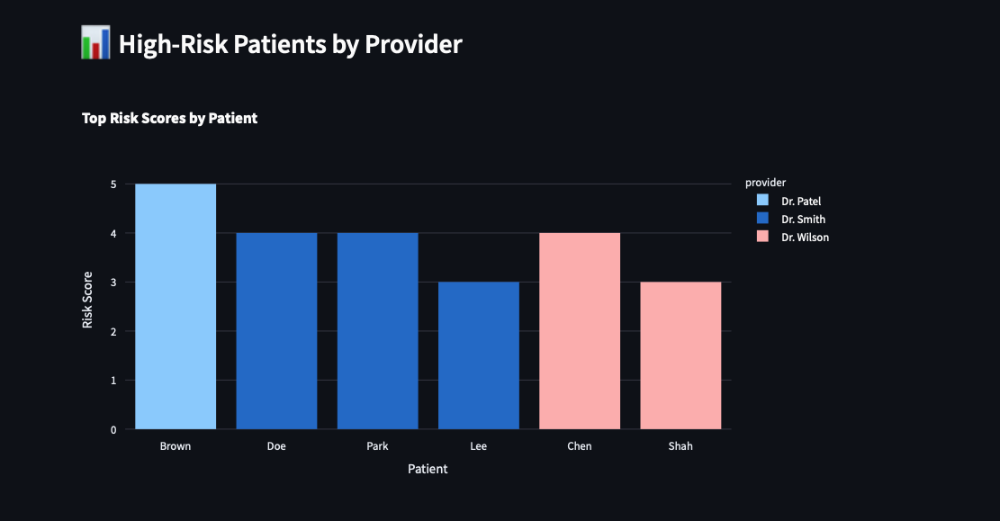

# 🩺 Hypertension Monitoring Dashboard

This Streamlit app simulates an Epic-style clinical report used in ambulatory settings to monitor patients with high blood pressure. Built from a practice dataset, it displays risk scores, blood pressure levels, and provider assignments with filterable charts and tables.

## 📊 Features

- Filter by provider, risk score, or visit date
- Sortable table of patients
- Bar chart of top-risk patients by provider
- Built using Python, Pandas, Streamlit, and Plotly

## 🗂️ Screenshots

| Dashboard | Filters | Chart | Table |
|-----------|---------|-------|-------|
|  |  |  |  |

## 📁 Files

- `hypertension_dashboard.py`: Streamlit app
- `hypertension_patients.csv`: Starter dataset
- `*.png`: Annotated screenshots

## 📝 Resume / Interview Ready

This project simulates an EMR report built from patient encounter data and mimics workflows often handled via Epic Radar or Clarity reports.

> *Example resume bullet:*  
> Built a Streamlit-based hypertension monitoring dashboard simulating Epic Clarity workflows for tracking risk scores, blood pressure, and visit history using custom filters and visual analytics.

